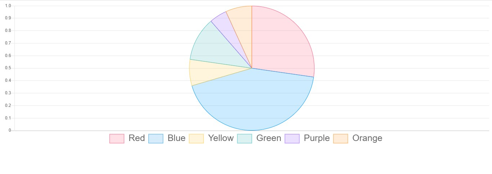

<h1 align="center">Index of React.js Works</h1>  
  
  | Project Code | Name     | Repo link                                                      |           Overview                  |
  |--------------|:--------:|:--------------------------------------------------------------:|------------------------------------:|
  |MKR-1    |IMDB | [Repository](https://github.com/marntext/IMDB)| |
  |MKR-2    |React Share Project | [Repository](https://github.com/marntext/react-share)| |
  |MKR-3    |ChartJs| [Repository](https://github.com/marntext/chartjs)||
  |MKR-4    |Movie App| [Repository](https://github.com/marntext/Movi-App)||
  |Cs-101120|Components | [Repository](https://github.com/marntext/Components)| |
  |Cs-121120|Styling in React | [Repository](https://github.com/marntext/Styling-in-React)| |
  |Cs-151120|Hooks | [Repository](https://github.com/marntext/Hooks)| |
  
